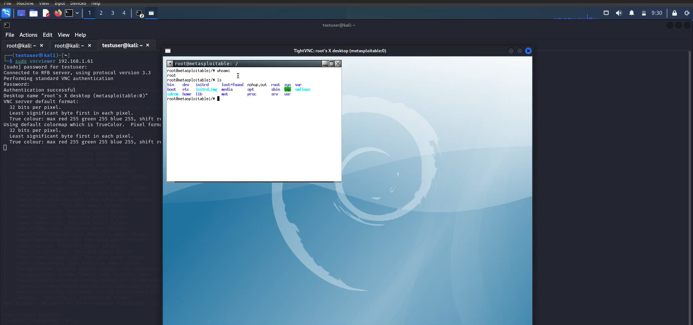
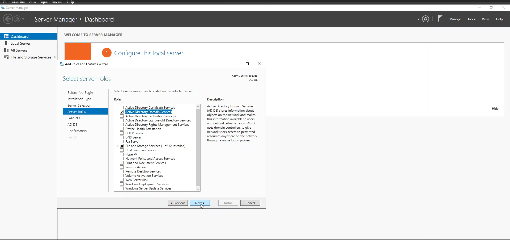
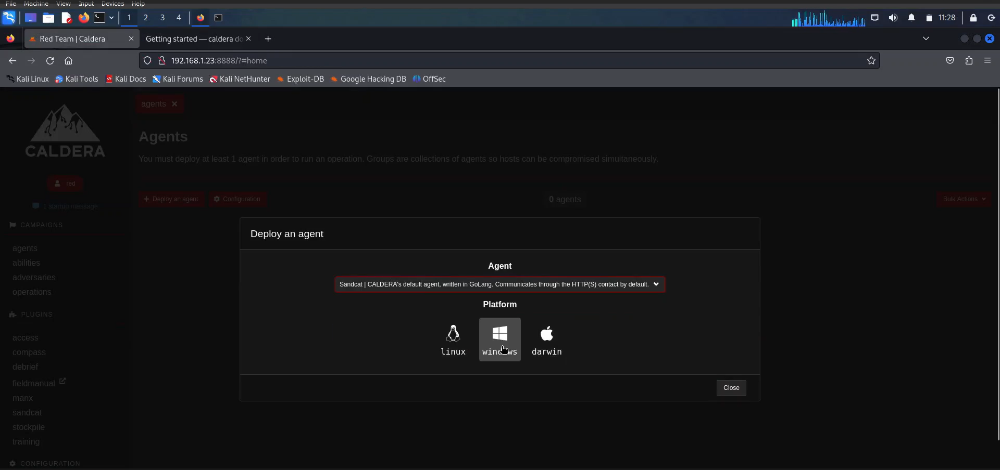
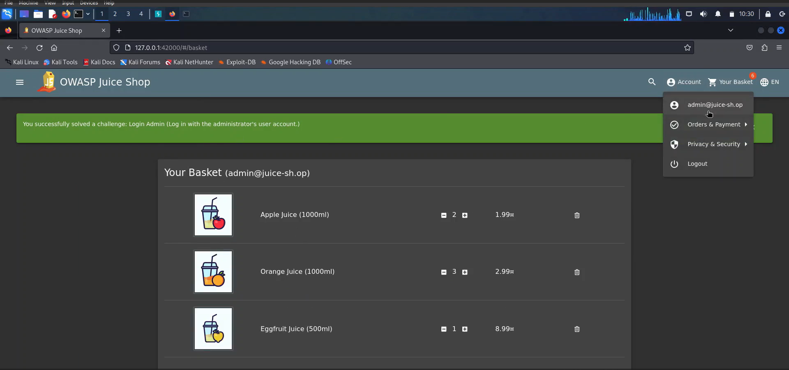
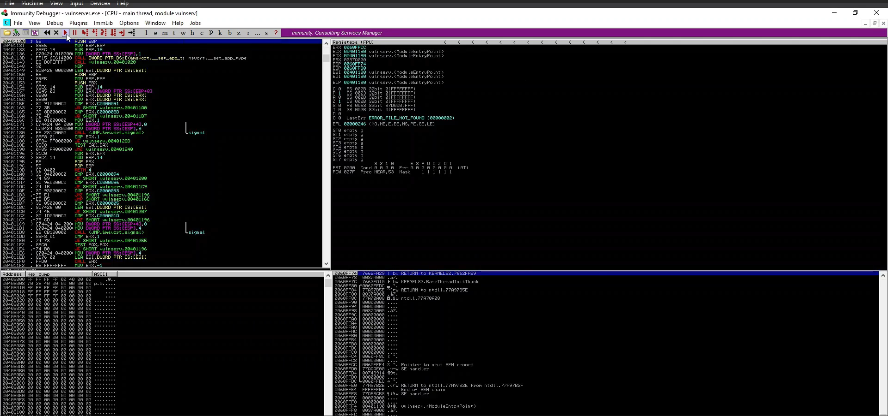
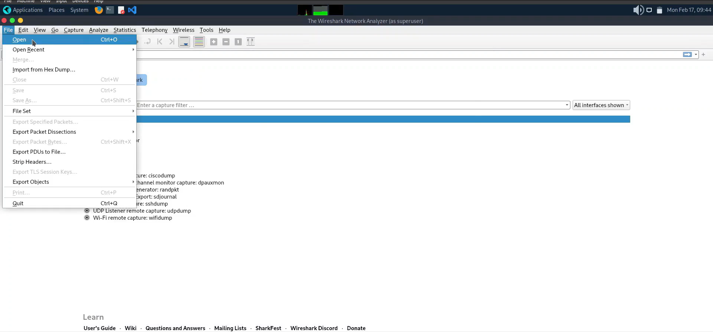

## Entry-Level Cyber Security Professional

Hello! I'm Yuvraj, a passionate and dedicated entry-level Cyber Security Professional with a strong foundation in network security, threat analysis, and ethical hacking. I am committed to safeguarding digital assets and ensuring the integrity, confidentiality, and availability of information.

### 💼 Professional Background
- 🔐 **Penetration Testing:** Conduct thorough security assessments to identify vulnerabilities in systems and networks.
- 🛡️ **Red Teaming:** Simulate cyber attacks to test the effectiveness of security controls and response mechanisms.
- 🌐 **Web Application Security:** Ensure web applications are secure from vulnerabilities and threats.

### 🛠️ Skills
- **Network Security**: Familiar with firewalls, intrusion detection systems, and VPNs.
- **Vulnerability Assessment**: Experience with tools like Nessus, Nmap, and OpenVAS.
- **Penetration Testing**: Skilled in conducting penetration tests using Metasploit, Burp Suite, and Wireshark.
- **Incident Response**: Knowledge of incident response protocols and forensics analysis.
- **Programming**: Proficient in Python, Bash scripting, and basic knowledge of C/C++.
- **Cybersecurity Frameworks**: MITRE ATT&CK, NIST, OWASP Top 10
- **Operating Systems:** , 

### 🛠️ Tools and Languages

### 🖥️ Projects
Here are a few projects that showcase my skills and experience in cybersecurity:

#### Project 1: Network Penetration Testing Lab
- Description: Set up a home lab for practicing network penetration testing techniques.
- Technologies Used:  Metasploit, Nmap, Nessus, Metasploitable 2

- GitHub Repository: [_View Project_](https://github.com/Yuvraj-Gurung/network-penetration-testing-lab)
- *[Watch the Live Demo](https://drive.google.com/file/d/14COmUOpalM-GN-HlMeS6UzyAWiBQ4-Fq/view?usp=sharing)*

#### Project 2: Active Directory Penetration Testing
- Description: Configured an Active Directory (AD) environment to identify and exploit potential vulnerabilities.
- Technologies Used: Kali Linux, Bloodhound, Windows Server 2022, Windows 10

- GitHub Repository: [_View Project_](https://github.com/Yuvraj-Gurung/active-directory-penetration-testing)
- *[Watch the Live Demo](https://drive.google.com/file/d/1DFy4RYO9kcsL3NeXz7vcOksCJvT6R91K/view?usp=sharing)*

#### Project 3: Red | Blue Teaming Lab
- Description: Simulated offensive and defensive tactics for adversary emulation and conducted real-world red team activities on a virtualized homelab environment.
- Technologies Used: Caldera, Havoc C2, Covenant, Atomic Red Team, MITRE ATT&CK

- GitHub Repository: [_View Project_](https://github.com/Yuvraj-Gurung/red-teaming-lab)
- *[Watch the Live Demo](https://drive.google.com/file/d/1C0vhyb5vzITJ8shrfBA_OdiJ2hXbMQ3I/view?usp=sharing)*

#### Project 4: Web Application Security
- Description: Performed a penetration test on a web application to uncover security weaknesses.
- Technologies Used: Burp Suite, OWASP ZAP, SQLmap

- GitHub Repository: [_View Project_](https://github.com/Yuvraj-Gurung/web-application-security)
- *[Watch the Live Demo](https://drive.google.com/file/d/11u7w-4QqMIAzdKep5S4RQQu3BUDYAjId/view?usp=sharing)*

#### Project 5: Windows Buffer Overflow | Exploit Development
- Description: Buffer overflow exploitation on Windows.
- Technologies Used: Kali Linux, Metasploit, Windows 10, Immunity Debugger, Python

- GitHub Repository: [_View Project_](https://github.com/Yuvraj-Gurung/windows-buffer-overflow)
- *[Watch the Live Demo](https://drive.google.com/file/d/148wmvsikdkQl84pkY3uX0hgZ6x-SRNt1/view?usp=sharing)*

#### Project 6: Wireshark | Pcap Traffic Analysis
- Description: Investigate suspicious network activity in an Active Directory (AD) environment.
- Technologies Used: Wireshark, Pcap File

- GitHub Repository: [_View Project_](https://github.com/Yuvraj-Gurung/wireshark-pcap-traffic-analysis)
- *[Watch the Live Demo](https://drive.google.com/file/d/16mir1P8zmAmD2IaWFJhX-LFyclmtuatT/view?usp=sharing)*

### 🎓 Certifications
- Ethical Hacking Essentials (EHE)
- CompTIA Security+ (SY0-601)
- Penetration Testing and Ethical Hacking
- Android Bug Bounty Hunting

### 📚 Education
- **[SRM University Sikkim]**, _Master of Computer Applications_
- **[Sikkim Manipal University - Distance Education]**, _Bachelor of Computer Application_

### 📈 Learning Paths

- **Online Platforms**: TryHackMe, Hack The Box, Web Security Academy
- **Future Goals**: Achieving OSCP certification

### 🌐 Get in Touch
- **Email**: [yuvrajgurung192@gmail.com](mailto:yuvrajgurung192@gmail.com)
- **LinkedIn**: [My LinkedIn Profile](https://www.linkedin.com/in/yuvraj-gurung)

---

Let's connect and collaborate on cybersecurity projects and initiatives!
